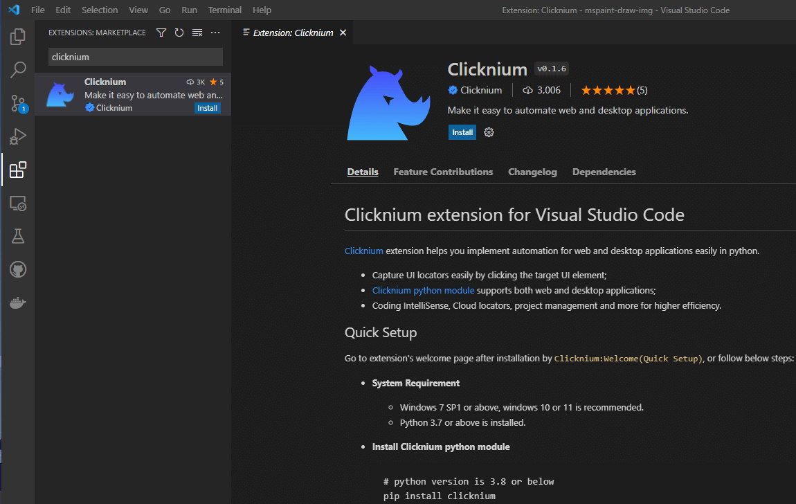
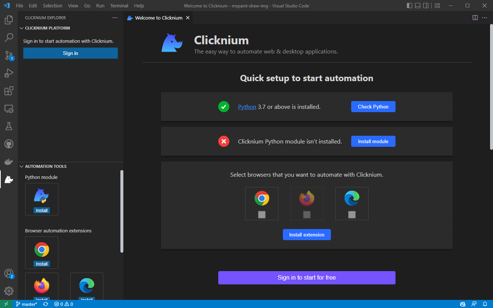
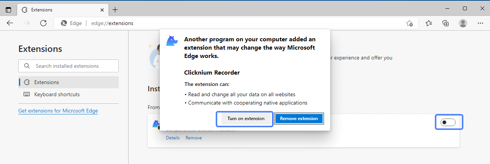

<!--
 Licensed to the Apache Software Foundation (ASF) under one
 or more contributor license agreements.  See the NOTICE file
 distributed with this work for additional information
 regarding copyright ownership.  The ASF licenses this file
 to you under the Apache License, Version 2.0 (the
 "License"); you may not use this file except in compliance
 with the License.  You may obtain a copy of the License at

   http://www.apache.org/licenses/LICENSE-2.0

 Unless required by applicable law or agreed to in writing,
 software distributed under the License is distributed on an
 "AS IS" BASIS, WITHOUT WARRANTIES OR CONDITIONS OF ANY
 KIND, either express or implied.  See the License for the
 specific language governing permissions and limitations
 under the License.
-->

[](https://badge.fury.io/py/Clicknium)
[](https://github.com/clicknium/clicknium-docs/issues)

[](https://twitter.com/clicknium)
[](https://join.slack.com/t/clicknium/shared_invite/zt-1gi6v3d85-8sBgen83vD6EhL48UEhxwQ)
[](https://discord.gg/s7Pcev8Ad4)


# توثيق مكتبة كلكينيوم (Clicknium)

[كلكينيوم ](https://www.clicknium.com) هو إطار أتمتة واجهة المستخدم الرسومية من الجيل التالي لأنواع مختلفة من التطبيقات. إنه يوفر تجربة مطور بسيطة ومبسطة مع واجهات برمجة تطبيقات عالية المستوى لأتمتة تطبيقات واجهة المستخدم الرسومية (GUI) والمكونات الإضافية الذكية. يمنحك نهجا جديدا لإنشاء عالم الأتمتة الخاص بك. كما يتم دعم أتمتة متصفحات الانترنت واختبار تطبيقات الويب وبرامج سطح المكتب وروبوتات كشط المواقع.

## المتطلبات
|                     | الاصدار الاساسي                | 
|---------------------|------------------------------|
| Python              | 3.7, 3.8, 3.9, 3.10          | 
| OS                  | ويندوز 11, 10 مستحسن, ويندوز 7 SP1 أو اعلى|
>ملاحظة: ويندوز 10 هو الحد الأدنى من نظام التشغيل ويندوز المدعوم لمعرفة DPI.    

### محرر الأكواد
- فيجوال ستديو كود (Visual Studio Code)

## البدء

احصل على مثال سكربت يعرض التشغيل التلقائي لصفحة الويب والمفكرة.

## التثبيت
### تثبيت ملحق كلكينيوم على فيجوال ستديو كود
1. قم بتثبيت [الملحق] (https://marketplace.visualstudio.com/items?itemName=ClickCorp.clicknium) (أو ابحث عن `Clicknium` في قائمة ملحقات Visual Studio Code).  
  
2. اضغط على `CLICKNIUM EXPLORER` في شريط المحرر
3. اتبع صفحة البداية: 
    - تحقق من بيئة بايثون.
    - قم بتثبيت كلكينيوم عبر الأمر `pip install clicknium`
    -  حدد وثبّت ملحقات المتصفح، بما في ذلك Edge على الأقل. ثم قم بتمكين الملحق بعد التثبيت في المتصفح. 
    - سجل الدخول مجانا للبدء.   
    
    

_لإعادة فتح صفحة الترحيب: افتح لوحة الأوامر: Ctrl+Shift+P, أدخل `Clicknium:Welcome`_

_لتمكين ملحق Edge: افتح متصفح Edge ، واكتب `edge://extensions/` في شريط العنوان وقم بتمكين `Clicknium Recorder` على النحو التالي:_

  


### مشروع مثال الإعداد
- انقر فوق `Clicknium: Sample` في صفحة الترحيب. أو قم باستدعاء لوحة الأوامر عن طريق الضغط على Ctrl + Shift + P وأدخل `Clicknium:` Sample`.
- اختر مسارًا لتحديد موقع نموذج المشروع.

يحتوي sample.py على عينتين من الأتمتة ، أحدهما هو أتمتة الويب Edge ، والآخر هو أتمتة المفكرة (Notepad).

```python
import subprocess
from time import sleep
from clicknium import clicknium as cc, locator, ui

def main():
    # نموذج كود لعرض أتمتة الويب وتطبيق سطح المكتب
    tab = cc.edge.open("https://www.bing.com/")
    tab.find_element(
        locator.new_store.sample.bing.search_sb_form_q).set_text('clicknium')
    tab.find_element(locator.new_store.sample.bing.svg).click()
    sleep(3)
    tab.close()

    process = subprocess.Popen("notepad")
    ui(locator.new_store.sample.notepad.document_15).set_text("clicknium")
    sleep(3)

if __name__ == "__main__":
    main()
```

### تشغيل المثال
في Visual Studio Code, افتح sample.py واضغط على `Ctrl+F5` لتشغيل السكربت. سوف تعمل: 
- افتح صفحة محرك البحث
- أدخل كلمة أساسية وانقر فوق زر البحث
- افتح المفكرة ( notepad )
- إدخال النص إلى المفكرة

## التالي 
تعرف على [كيفية بدء مشروع الأتمتة من الصفر](./doc/tutorial/firstautomation.md).

## اتصل بنا
مرحبا بك في [Github Issue](https://github.com/clicknium/clicknium-docs/issues) او الانضمام [Clicknium Slack](https://clicknium.slack.com/) إذا كان لديك أي أسئلة.
_الدعم العربي بواسطة: خالد عكور_
