# الاسئلة الشائعة

## فشل تسجيل الدخول (Login Failure)

عند محاولة تسجيل الدخول وحصلت على خطأ: `Uncaught SecurityError: Failed to read the 'localStorage' property from 'Window': Access is denied for this document.`  يتم طرح هذا الاستثناء عند تعيين مربع الاختيار "حظر ملفات تعريف الارتباط وبيانات الموقع للأطراف الثالثة" في إعدادات المحتوى.  
للعثور على الإعداد ، افتح إعدادات Chrome ، وانقر على `Privacy and security`  في شريط التنقل ، انقر على `Cookies and other site data` ، واعرض العنصر الثالث ضمن إعدادات عامة.
  
إذا تم تحديد هذا الإعداد ، فلن يُسمح بملفات تعريف ارتباط البرامج النصية للجهات الخارجية وقد يؤدي الوصول إلى localStorage إلى استثناءات SecurityError.

## Can not automate browser running instances with different user profiles

إذا واجهت المشكلة اللاحقة عند التسجيل:

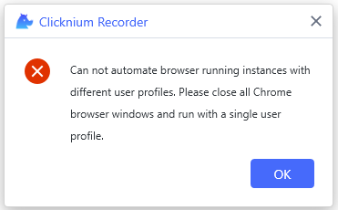

هذا يرجع إلى احتمال أن تكون قد بدأت العديد من نوافذ متصفح Chrome باستخدام ملفات تعريف مستخدم مختلفة. يظهر كل ملف تعريف مستخدم لنافذة متصفح Chrome في الزاوية العلوية اليمنى.

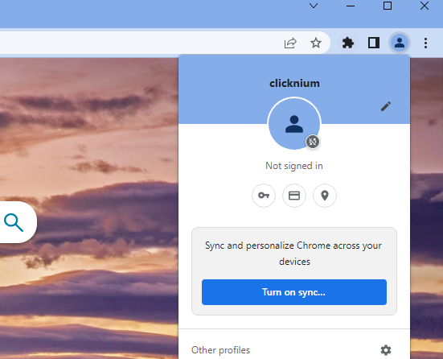

يمكنك حل هذه المشكلة عن طريق إيقاف Clicknium Recorder أولاً ، وإغلاق جميع علامات تبويب المتصفح المفتوحة ، وفتح المتصفح فقط في ملف تعريف مستخدم واحد ، ثم بدء تسجيل جديد.

## This element is not similar to previous elements. Please capture it again

إذا واجهت المشكلة اللاحقة عند تسجيل عناصر مماثلة، 

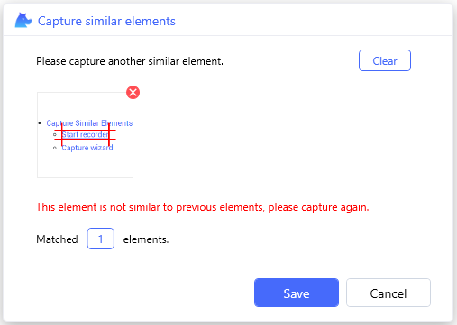

يجب أن يكون محدد الموقع المسجل الجديد مختلفًا عن القديم هو العامل الأساسي. فمثلا:

- وهي عناصر من أنواع مختلفة ، على سبيل المثال: أحدهما بعلامة "a" والآخر بعلامة "div".
- هم تحت إطارات مضمنة مختلفة.

لمزيد من المعلومات ، يرجى الرجوع إلى [التقاط عناصر مماثلة](tutorial/recorder/capture_similar_elements.md)

## Browser extension for Chrome is not turned on, do you want to turn it on now?

إذا واجهت المشكلة اللاحقة عند تسجيل العناصر على صفحة متصفح واحدة،

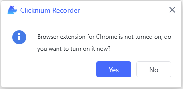

يجب أن يكون السبب الرئيسي هو عدم تمكين ملحق متصفح Clicknium ، يمكنك النقر على "Yes" ، وسيتم فتح صفحة ملحق المتصفح ، ويمكنك تمكينها:

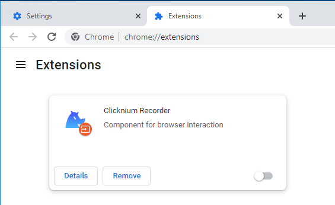

وقم بتحديث صفحة الويب أو أعد فتح نافذة المتصفح ، وقم بالتسجيل مرة أخرى.

## ModuleNotFoundError: No module named 'tkinter'

قد تظهر رسالة الخطأ التالية عند تشغيل المشروع أو حزمه.

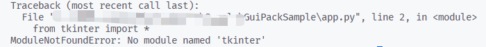

احصل على إصدار بايثون الذي يحتاجه المشروع عن طريق فتح ملف clicknium.yaml في مجلد المشروع.

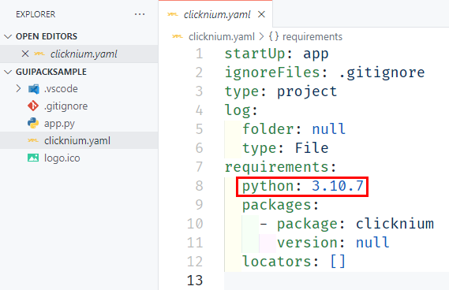

أولاً ، تحقق مما إذا كان الإصدار الصحيح من بايثون مثبتًا بالفعل على جهاز الكمبيوتر الخاص بك.

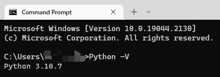

إذا كان مثبتًا بالفعل ، فاستخدم "Python -m tkinter" للتحقق مما إذا كانت tkinter موجودة.

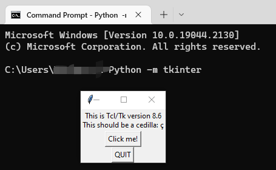

بخلاف ذلك ، أعد تثبيت بايثون وحدد المربع "tcl / tk and IDLE".

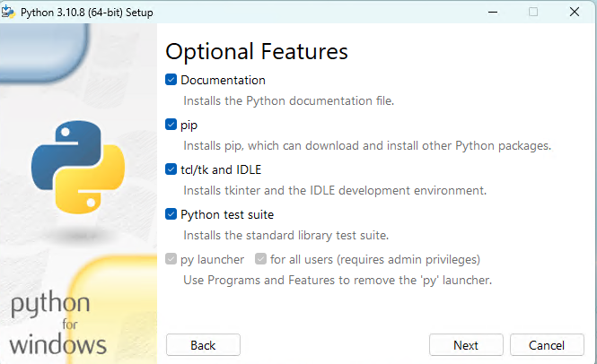

إذا لم يتم تثبيت بايثون ، فقم بتنزيل الإصدار المناسب وتثبيته.

افتح المجلد "%LOCALAPPDATA%\Clicknium\Envs" ثم حدد موقع اسم المشروع الذي يتوافق مع مجلد بيئة بايثون الافتراضية.

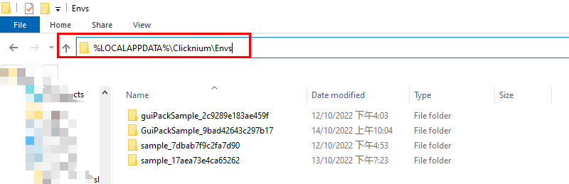

في ملف "pyvenv.cfg" ، قم بتغيير "home" إلى مسار تثبيت بايثون

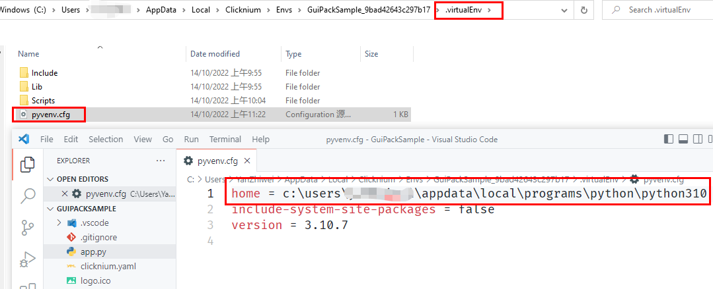

سيعمل المشروع بشكل طبيعي ، يمكنك تشغيله مرة أخرى في Visual Studio Code وحزمه.
