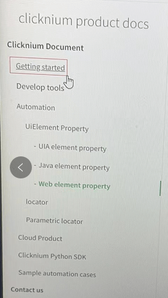

# أتمتة الصور Image Automation

## ملخص
تدعم وظيفة أتمتة كلكينيوم مع العديد من الوظائف التي تدعم أتمتة الصور.
تم تصميم مخطط محدد موقع كلكينيوم للتمديد في محدد مواقع برامج الويندوز ومحدد موقع برامج Java ومحدد موقع الصور. (locator)

## التقاط موقع صورة محدد Capture image locator
افتح مشروعا في Visual Studio Code بالضغط على `Ctrl + F10`، أو النقر فوق الزر `Capture` لاستدعاء مسجل كلكينيوم.
  

- مرر مؤشر الماوس فوق العنصر لتحديده.   
- اضغط على `Ctrl` وانقر على العنصر لالتقاط محدد موقعه.  
- اضغط على `Shift` وحدد منطقة واحدة بالماوس لالتقاط الصورة وسيتم تخزينها كصورة في محدد المواقع. 

   

فمثلا 
- اختر العنصر الهدف

  
- اضغط على `Shift` واسحب لتحديد منطقة  

  

سوف تحصل على محدد المواقع على النحو التالي:   
  

يحتوي محدد الصورة على جزأين.
الجزء الأول هو عنصر الارتساء. في عملية التشغيل ، ابحث أولاً عن عنصر الارتساء ، ثم التقط صورة المرساة اعتمادًا على سمات طريقة الصورة ، وابحث عن الصورة المستهدفة في صورة الإرساء عن طريق خوارزمية مطابقة الصورة.
الجزء الثاني عبارة عن صورة تدعم السمات (attributes) التالية:  

| الاسم      | الوصف | يساوي | يحتوي |أبدا ب |انتهت ب |
| ----------- | ----------- |----------- |----------- |----------- |----------- |
| accuracy | الحد الأدنى من التشابه بين الصورة المستهدفة والصورة الموجودة في محدد الصورة. يكون مفيدًا عندما تكون الصورة التي يتم العثور عليها مختلفة قليلاً عن تلك الموجودة في محدد المواقع. وحدة القياس من 0 إلى 1 بقيمة افتراضية 0.75. |<font color="Green"><B>نعم</B></font>   |<font color="Red"><B>لا</B></font>|<font color="Red"><B>لا</B></font>|<font color="Red"><B>لا</B></font>|
| dpi |  نوصي بأن تكون إعدادات DPI لنظام التشغيل ويندوز في عملية التشغيل هي نفس الإعدادات عند التسجيل|<font color="Green"><B>نعم</B></font>   |<font color="Red"><B>لا</B></font>|<font color="Red"><B>لا</B></font>|<font color="Red"><B>لا</B></font>|
| method | تحدد قيم التعداد خوارزمية مطابقة الصورة. يتم ضبط القيمة تلقائيًا عند التسجيل | <font color="Green"><B>نعم</B></font> |<font color="Red"><B>لا</B></font>   |<font color="Red"><B>لا</B></font>|<font color="Red"><B>لا</B></font>|<font color="Red"><B>لا</B></font>|
| filePath | منطقة اختيار تسجيل الصور ، المستخدمة في عملية مطابقة الصور |<font color="Green"><B>نعم</B></font>   |<font color="Red"><B>لا</B></font>|<font color="Red"><B>لا</B></font>|<font color="Red"><B>لا</B></font>|
| matchIndex | والتي سيتم تحديدها عند العثور على أكثر من منطقة واحدة أثناء مطابقة الصورة ، الافتراضي هو 0 ، وهذا يعني منطقة المطابقة الأولى |<font color="Green"><B>نعم</B></font>   |<font color="Red"><B>لا</B></font>|<font color="Red"><B>لا</B></font>|<font color="Red"><B>لا</B></font>|
| elementRect | قم بتخزين منطقة عنصر الربط أثناء التسجيل. لا حاجة لتعديل القيمة |<font color="Green"><B>نعم</B></font>   |<font color="Red"><B>لا</B></font>|<font color="Red"><B>لا</B></font>|<font color="Red"><B>لا</B></font>|
| selectionRect | تخزين منطقة الاختيار أثناء التسجيل. لا حاجة لتعديل القيمة  |<font color="Green"><B>نعم</B></font>   |<font color="Red"><B>لا</B></font>|<font color="Red"><B>لا</B></font>|<font color="Red"><B>لا</B></font>|
| timeout | حدد الحد الأقصى للفاصل الزمني في مطابقة الصورة ، الافتراضي هو 5000 مللي ثانية |<font color="Green"><B>نعم</B></font>   |<font color="Red"><B>لا</B></font>|<font color="Red"><B>لا</B></font>|<font color="Red"><B>لا</B></font>|

تعريف الطرق::
- HighestAccuracy: مقارنة الصور الموجودة في شاشة الويندوز بأكملها
- InRegionHighestAccuracy: مقارنة الصور الموجودة في منطقة عنصر الربط
- OutRegionHighestAccuracy: مقارنة الصور التي تم العثور عليها من منطقة عنصر الربط

`method` يتم تعيين السمات تلقائيًا بناءً على منطقة التحديد ومنطقة الارتساء المقابلة في عملية التسجيل إذا كانت منطقة التحديد داخل منطقة عنصر الربط ، فاضبط على 'InRegionHighestAccuracy'.  
إذا كانت منطقة التحديد تتقاطع مع منطقة عنصر الربط ، فاضبط على 'HighestAccuracy'.
إذا كانت منطقة التحديد خارج منطقة عنصر الربط، فاضبط على 'OutRegionHighestAccuracy'.

## استخدام محدد الصورة في المشروع
يمكن استخدام محدد موقع الصور بنفس طريقة استخدام محددات المواقع الأخرى ، على سبيل المثال  
```python
from clicknium import clicknium as cc, locator, ui


#open new browser window
driver = cc.chrome.open("https://www.bing.com")
driver.find_element(locator.chrome.img1).click

ui(locator.notepad.menuitem).click()
```  

تدعم الوظائف التالية محدد موقع الصورة:
- click
- double_click
- mouse_up
- mouse_down
- drag_drop
- get_position
- get_size
- highlight
- hover
- send_hotkey
- set_text (العامل `by` يجب ان يكون `sendkey-after-click`)

## مثال
إذا تعذر تحديد موقع التطبيق أو عنصر واجهة المستخدم الهدف بواسطة تقنيات التشغيل الآلي الأخرى عندما تكون صورة المنطقة مستقرة ، فيمكن للمستخدمين تجربة محدد موقع الصورة.
