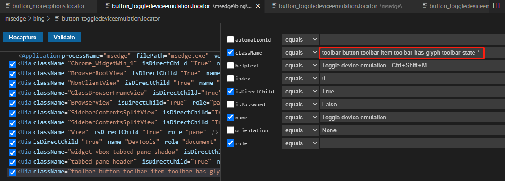
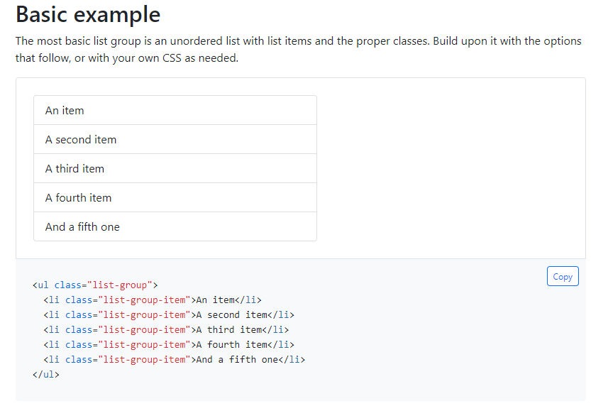

# Locator 

## Overview 
A locator(a.k.a. selector) is a way to identify elements on a web page or desktop app.   
  
## Locator Settings
 Locators have the rich feature to meet different UI automation needs. 
 - Locator: UI element locator, the string(XML fragment) that used to find the elements including application information and all necessary parent nodes of the UI element, and attributes of each element.
- Locator store: the file to store locator data. The locators of the same application are stored in one locator store by default. Users can manage the locator store in Visual Studio Code or Clicknium Recorder.
- Screenshot: while recording the elements, store the screenshot together with the locator
- Attributes: users can select/deselect or edit the value of each attribute.  
---
You can open and edit the locator.
  
UI element locator is a string, XML fragment in the following formats, with all information to locate the element.  
```
<Application .../><Uia .../>/<Uia .../>  
<Application .../><Tab .../>/<Web .../>  
```
First node `Application` contains attributes of the target application
<Application processName="notepad" filePath="notepad.exe" version="1.3" />  

| Name      | Description |
| ----------- | ----------- |
| processName      |  name of the target process   |
| filePath      |  the name of process file, can be ignored when locating element  |
| version      |  clicknium locator schema version   |  

The last node contains the attibutes of the target UI element.
The nodes between `Application` and the last node are the parent or ancestor of the target element.

The attributes in locator are used to identify the target element. The operator of attribute value is `equals` by default, and we support the following operators:
`equals`, `contains`, `startWith`, `endWith`.  
The attributes only supporting wildcard search, for example `name='test?_node*`. '?' match 1 character, '*' match 0 or more characters can use `contains`, `startWith`, `endWith`.  
As Clicknium supports different automation technologies, shown as diffrent tags and attributes collection in locator schema, you can see the attributes defined in each automation technology page: [UIA](./uia.md), [IA](./ia.md), [web](./web.md), [Java](./java.md).  


### Examples
Open Edge browser, press `F12` to show developer tool sidebar, you can see the button 'Toggle device emulation'.
  
If you capture the locator of button 'Toggle device emulation', you can see the following locators.

- Normal mode  
  
  
- Mobile emulation mode  

  

## Wildcard locator
When the matching rule of attibutes is "equals", the value supports wildcard characters.  
  
|Wildcard characters| Functions |
|-------|----------|
|*    | Substitute one or more characters |
|?    | Substitute a character |

### Examples
The attribute of classname is dynamic. To stabilize identification of button 'Toggle device emulation', you can leverage wildcard locator.  
 

In both modes, the button can be located successfully.
And you can know the current mode through get_property. 
```
from clicknium import clicknium as cc, ui, locator

class_name = ui(locator.msedge.bing.button_toggledeviceemulation).get_property("ClassName")
if class_name.endswith('state-off'):
    print('normal mode')
else:
    print('mobile emulation mode')
```

The following cases can be considered as wildcard locator:
- the window title is dynamic, for example the title includes version string, but application version can be upgraded
- the url of the web page is dynamic
- value of the attribute is dynamic

## Parametric Locator
 Parameters in locator string can be used as value or partial value of the attribute in parametric locator. Users can use the parametric locator in the automation project to replace the ones with the varaibles or data. This allows the locator to match series of elements, instead of single target element.  

1. Declare a parameter with [Mustache style](https://github.com/mustache/mustache.github.com) in locator attributes: {{varaible}}. The parameters in locator formats as the following:  
`<Web ancestorId="{{id}}" tag="A" />`  
or set partial value as parameter:  
`<Web ancestorId="video-{{id}}" tag="A" />`

2. Use parametric locator in the project  
```python
from clicknium import clicknium as cc, locator, ui
# replace varaible 'id' in parametric locator during runtime
variables = {"id":"test"}
ui(locator.chrome.bing.search_sb_form_q, variables)
```

### Examples
How to use the parametric locator for web page and Windows applciation? Here are two examples.
#### Web Example  
Sample website: https://getbootstrap.com/docs/5.1/components/list-group/
  
Recorder the first item in list. The following is the locator attributes after recording:  
  
Add a parameter in [Mustache style](https://github.com/mustache/mustache.github.com) as following to loop over each item:   
  

```python
from clicknium import clicknium as cc, locator, ui

index = 1
driver = cc.chrome.open("https://getbootstrap.com/docs/5.1/components/list-group/")
while True:
    variables = {"indexValue":index}
    if driver.is_existing(locator.chrome.getbootstrap.li_anitem, variables):
        text = driver.find_element(locator.chrome.getbootstrap.li_anitem, variables).get_text()
        print(text)
        index += 1
    else:
        break
```

-  Windows application Example  
  
Locate the menu item, the locator string is as following after recording:  
  
Add parameters in the locator attributes as following and loop over each menu item in the code :  
  

```python
from clicknium import clicknium as cc, locator, ui

titles = {'File', 'Edit', 'Format', 'View', 'Help'} 

for title in titles:
    variables = {"title":title}
    text = ui(locator.chrome.getbootstrap.li_anitem, variables).get_text()
    print(text)
```