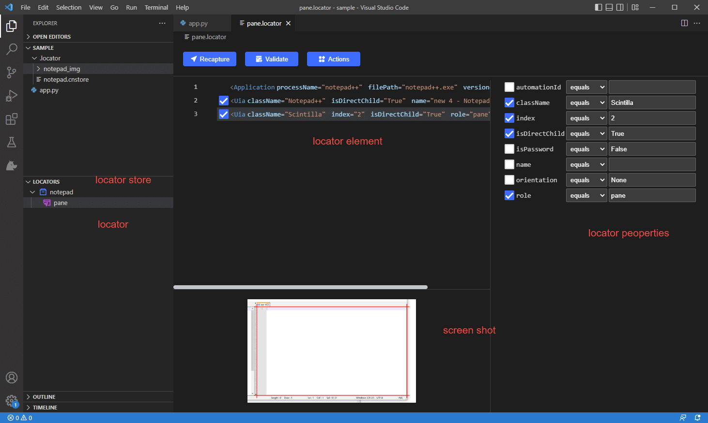

# Clicknium VSCode Extension<!-- {docsify-ignore-all} -->

  - [Overview](#overview)
  - [Create Project](#create-project)
  - [Extension Installation](#extension-installation)
  - [Record UI Locators](#record-ui-locators)
  - [Edit and Validate Locator](#edit-and-validate-locator)
  - [Writing code](#writing-code)
  - [Run/Debug Project](#rundebug-project)
  - [For Existing Project](#for-existing-project)

## Overview
For python developer, if you use Visual Studio Code, ClickCorp provides clicknium extension that include all RPA features. 
With the extension for Visual Studio Code, you can create python automation project, capture UI elements in browsers and in various desktop applications, easily edit UI locator, validate or recapture, run/debug the automation project, and provide centeral locator store management on the cloud.
 Besides, Clicknium also improves writing code experience, such as providing IntelliSense, error hint, etc.

***Installation​***: Install through VS marketplace `Clicknium VS Code extension` or search clicknium in Visual Studio Code.  
***Remarks***: As Clicknium extension is completely free, developers can use all features in Visual Studio Code.

## Create Project

## Extension Installation
[Automation Extensions](./doc/developtools/extensions/extensions.md)

## Record UI Locators
In Visual Studio Code, press `CTRL+F10` to invoke Clicknium recorder and minimize current Visual Studio Code window.  
  
The capture technology indicates which automation technology currently used to capture UI elements. The supporting automation technology are as follows:
- UIA： Leverage Microsoft UI Automation, used for most windows application such as win32, winform, WPF application and so on
- IA: based on MSAA (Microsoft Active Accessibility)
- Java: automation for Java application, supporting JRE version above 1.6
- IE: automation for Internet Explorer, supporting version above 5.5 
- Chrome: automation for Chrome ,installation of chrome extension is need at first, supporting version above 60
- Edge: automation for Edge, installation of Edge extension is needed at first
- Firefox: automation for Firefox, installation of Firefox extension is needed at first, supporting version above 56
- SAP: automation for SAP WinGUI, SAP GUI Scripting setting is enabled at first 
  
Default is ***Auto Detect***, which means clicknium recorder automatically select the technology:  
If the mouse moves on Windows applicaiton, it will use UIA technology to locate the element;   
If the mouse moves on Java applicaiton, it will use Java technology to locate the element;   
If the mouse moves on Internet explorer, it will use IE technology to locate the element;   
If the mouse moves on Chrome, it will use Chrome technology to the locate element;   
If the mouse moves on Microsoft Edge, it will use Edge technology to locate the element;   
If themouse moves on Firefox, it will use Firefox technology to locate the element;   
If mouse moves on Sap windows GUI, it will use SAP technology to locate the element

Advanced Option: default is None, when you choose `XPath`, it will come into effect on web automation technology(IE, Chrome, Edge, Firefox).
When capturing the element, it will generate locator in XPath style.

Cursor Position(X,Y): indicate current mouse postion in screen

After invoke Clicknium Recorder, you can move mouse on the target applicaiton, it will highlight the element recognized, 
if you want to capture the element, press `Ctrl` and click, the element locator will be added.

 

## Edit and Validate Locator
After record the locators, you can open and edit the locator  
 

- locator store: file to store locator data. the locators of the same application are stored in one locator store defaultly, user can manage the locator store from Visual Studio Code or Clicnium Recorder.
- locator: Ui element locator, locator is string(XML fragment) that used to find the element, it includes application info, includes all necessary parent nodes of the element in the user interface, and using several attributes to identify each node include element itself.
- Screenshot: during record the element, we will store the screenshot together with the locator
- Attributes: user can select/deselect or edit the value of each attribute

More about locator, please refer to [clicknium locator](./doc/automation/locator.md)

After edit locator, you can press `Validate` button to verify, it will minimize Visual Studio Code and highlight the found element, if not found, will show detail error.

## Writing code
- Auto Code Complete
when you write code, need pass locator as parameter, for example, `cc.find_element(`, you can press `Ctrl`+F10, invoke clicknium recorder, and capture element, return back to Visual Studio Code, the captured element will be auto filled like `cc.find_element(locator.chrome.bing.search_sb_form_q)`

- IntelliSense
You can select one locator already in locator store, clicknium code extension can help you to show locator store list and locator list  

## Run/Debug Project

## For Existing Project