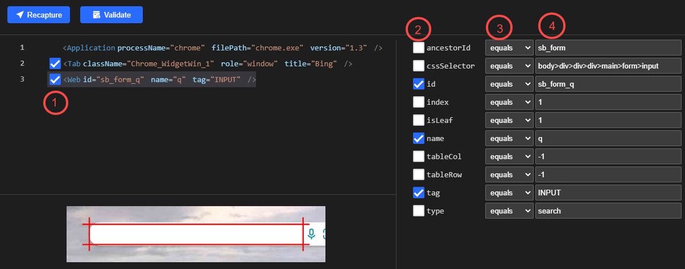
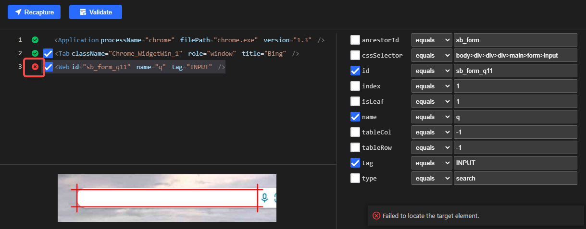
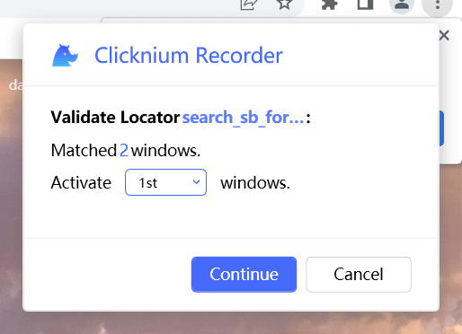

# Locator Management<!-- {docsify-ignore-all} -->

  - [Edit Store](#edit-store)
  - [Edit Folder](#edit-folder)
  - [Edit Locator](#edit-locator)
  - [Recapture](#recapture)
  - [Validate](#validate)

## Edit Store

  
    
1. New Folder: 选择的Store下创建文件夹
2. Remove Reference： 项目中移除引用的Store
3. Rename：引用的Store修改别名，代码中使用别名

## Edit Folder

  

1. New Folder: 选择的Folder下创建文件夹
2. Rename：修改folder的名字
3. Delete: 删除folder

## Edit Locator

  

1. Open: vscode编辑窗口打开locator详细内容。
2. Validate: 验证locator的有效性。
3. Copy: 在同目录下生成一个内容相同的locator
4. Copy Path: 服务locator的路径，粘贴到python代码中可直接使用。
5. Rename: 修改locator的名字
6. Delete: 删除locator

  

- 编辑locator详情页分为左右两部分。
- 左侧：按照locator的层级已XML的形式展示。
- 右侧：显示左侧选中的xml节点对应的属性详情。

- 输入项①：勾选locator层级，未勾选的执行时查找元素会忽略此层级。
- 输入项②：勾选选中层级对应的属性。未勾选的执行时查找元素会忽略此属性。
- 输入项③: 匹配规则
|equals   |完全一致  |
|contains |包含值即可|
|startWith|左侧一致  |
|endWith  |右侧一致  |
- 输入项④：属性匹配的值
    注意：匹配规则为equals时，值支持统配符。
    |通配符| 作用                 |
    |*    | 用来替代一个或多个字符 |
    |?    | 用来替代一个字符      |

## Recapture
1. 点击Recapture按钮，打开录制器，重新录制locator。
2. 录制对应的元素。
3. 录制成功后返回到vscode。Ctrl+S保存最新录制的元素。
   
## Validate
点击Validate按钮

### Validate成功
1. 执行器会打开包含locator的window。并标记出对应的locator
  

2. 几秒钟后，自动返回到vscode窗口，并标记正确
3. 
  

### Validate失败
- 执行器找不到对应的locator，几秒钟后，会自动返回vscode窗口，并标记没有找到的层级。

  
- 注意：验证时不会打开应用并输入对应的地址，如果错误标记在第一层或第二层，请确认应用和网址是否打开。

  

### 验证时，多Window存在时
- 打开的有多窗口中同时包含locator时，执行器会提供选择window的窗口

  

- 选择窗口后，会在对应的窗口验证并返回vscode

### 验证时，定位到多个元素时
- 窗口中匹配到多个locator时，执行器会提供选择locator index的窗口
- 切换Index，会高亮出对应的locator 
  
  

- 如果想把切换到的Index更新到locator当中，勾选 set single target，并点击OK。
  
  

- 切换回vscode后，在对应的Index属性上，会更新为最新的index，并处于勾选状态。
  
  