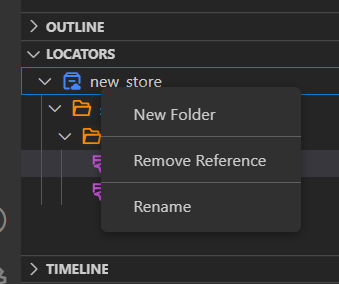
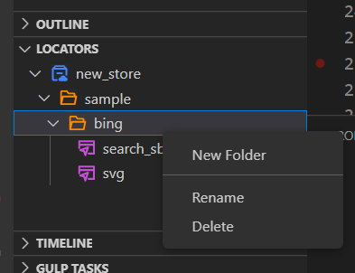
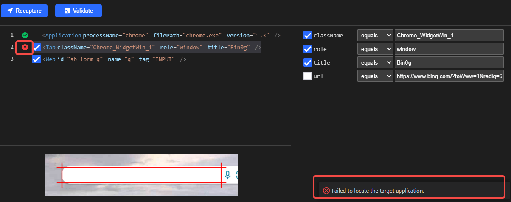
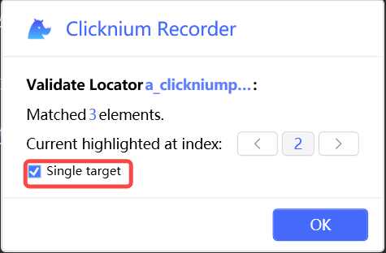

# Locator Management<!-- {docsify-ignore-all} -->

  - [Edit Store](#edit-store)
  - [Edit Folder](#edit-folder)
  - [Edit Locator](#edit-locator)
  - [Recapture](#recapture)
  - [Validate](#validate)

## Edit Store

  
    
1. New Folder: create a new folder under the selected store
2. Remove Reference：remove the referenced store in the project
3. Rename：rename the referenced store in the code

## Edit Folder

  

1. New Folder: reate a new folder under the selected store
2. Rename：rename the folder
3. Delete: delete the folder

## Edit Locator

  

1. Open: open locator details in the VScode edit window. 
2. Validate: validate the locator.
3. Copy: creat a same locator under the same directory.
4. Copy Path: The path of a service locator can be pasted and used directly in the Python code.
5. Rename: rename the locator
6. Delete: delete the locator

  

- The details page of editing the loactor is divided into two parts,left and right.
- Left part:display as XML based on the locator hierarchy 
- Right part：display the attribute details for the selected XML node on the left part.

- Input item ①: Check the locator tier. This unselected tier will be ignored if the elements are searched in the execution. 
- Input item ②：Check the selected the property of the tier. This unselected property will be ignored if the elements are searched in the execution.
- Input item ③: There are 4 matching rules, "equals", "contains", "startwith" and "endwith".
  
- Input item ④：The values of the property
    Notes：When the matching rule is "equals", the value supports wildcard characters.
    |Wildcard characters| Functions                 |
    |-------|----------|
    |*    | Substitute one or more characters |
    |?    | Substitute a character      |

## Recapture
1. Click the "Recapture" button to open the recorder and record the locator again.
2. Record the corresponding element.
3. When recording succeeds, return to vscode and   save the newly recorded element by pressing Ctrl+S.
   
## Validate
Click "Validate" button.

### Validate success
1. The executor opens the window containing a locator and  marks the corresponding one.
  

2. Within a few seconds, it automatically returns to the vscode window and marks as correct.
3. 
  

### Validate failure
- If the executor cannot find the corresponding locator, it automatically returns to the vscode window within a few seconds and marks the hierarchy that cannot be found.

  
- Notes: The application will not be opened and the corresponding URL will not be entered in the verification. If the error is marked in layer one or layer two , please confirm whether the application and URL are opened.

  

### Multiple windows exist in validation
- If multiple opened Windows contain the locator at the same time, the executor will provide a pop-up dialog to select Window.

  

- After selecting the one among the matched windows, the corresponding window will be validated with in a few second and return to vscode.

### Multiple elements are located in validation
- If multiple locators are matched in the window, the actuator will provide a window for selecting the locator index. 
- If you switch the Index, the corresponding locator is highlighted.
  
  

- If you want to update the switched Index in a locator, check "set single target" and click "OK". 
  
  

- After switching back to vscode, the corresponding Index property will be updated as the latest Index and checked. 
  
  