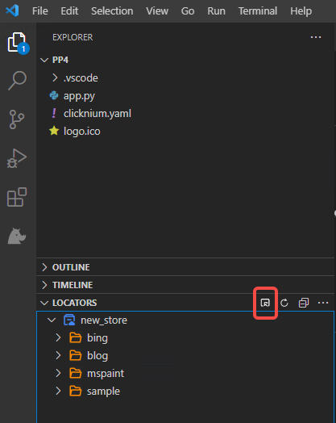
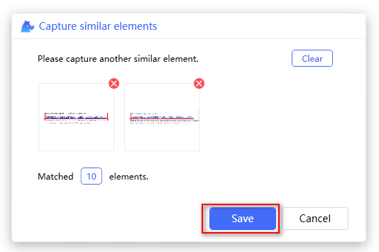

# Capture Similar Element

Capture similar element can be used to recoder elements with similar properties. A similar locator is intelligently generated based on the captured elements.

- [Start recorder](#start-recorder)
- [Capture wizard](#capture-wizard)
- [Start capture](#start-capture)
- [Clear elements](#clear-elements)
- [Remove element](#remove-element)
- [Cancel capture](#cancel-capture)
- [Recapture](#recapture)

> **Remarks:**
>- Capture similar elements support web capture techlogies without XPath advance option for now.
>- Image capture is not supported for now.

## Start recorder
- Start from Visual Studio Code LOCATORS tab  

- Strat from Visual Studio Code CLOUD LOCATORS tab  

- Start with pressing hotkey `Ctrl+F10`  

## Capture wizard  
Click on the `Capture Similar Element` icon, a wizard window will be displayed.
- Capture similar element icon

- Wizard window

## Start capture

1. Capture first element.  
When mouse moving, it will highlight the UI element. Press `Ctrl+click` to capture element.
Element image and matched elements count will be displayed in the wizard window.

2. Capture another element.
Capture another element in the same way as the first element.
New captured element iamge and matched elements count will be displayed in the wizard window.

3. Save the similar locator.
Click `Save` to save the locator, locator will be added to the locator store tree.

## Highlight elements
Highlight all matched elements in the view at once.
- Click the matched elements count button

## Clear elements
Clear all the elements captured in the wizard window, the `Clear` and `Save` buttons will be disabled.
- Click the `Clear` button

## Remove element
Remove one captured element in the wizard window.
- Click the `Remove` icon

## Cancel capture
Discard the current capture result and return to the main capture window.
- Click the `Cancel` button

## Recapture
Recapture similar element can be used to update your single locator or similar locator.
- Start from Visual Studio Code   

- Recapture winow   

- Capture similar element icon

- [Start capture](#start-capture)