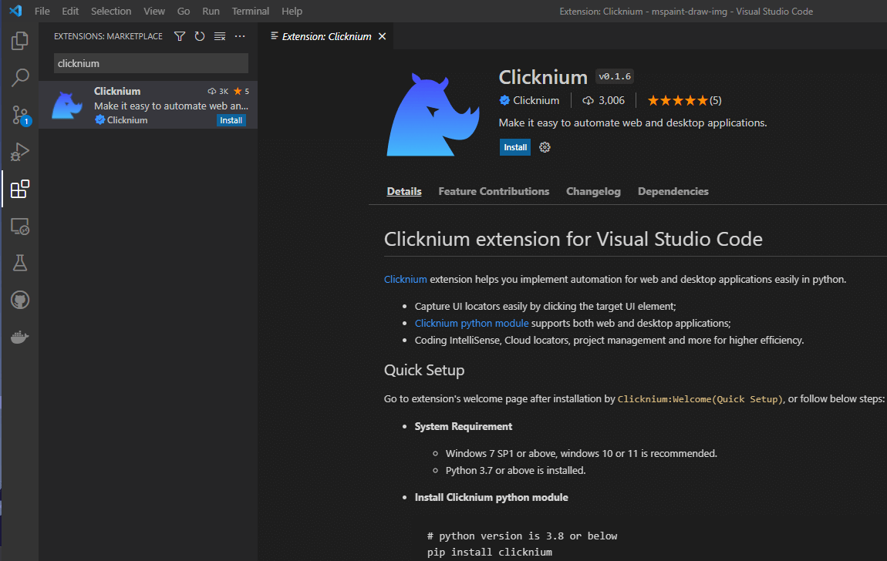
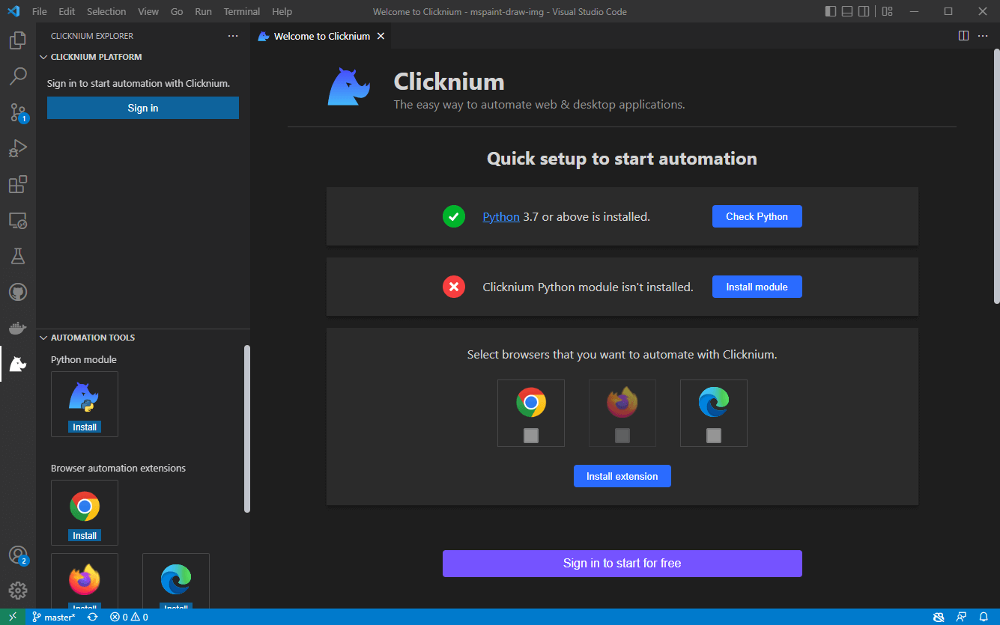
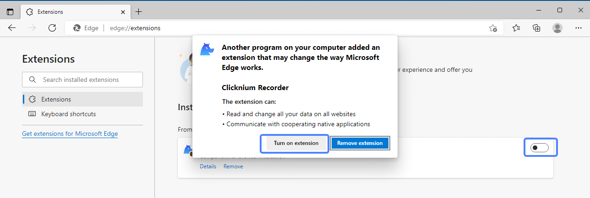

# بداية سريعة

## المتطلبات الأساسية
### متطلبات النظام​
|                     | الاصدار الرئيسي                 | 
|---------------------|------------------------------|
| Python              | 3.7, 3.8, 3.9, 3.10          | 
| نظام التشغيل                  | Windows 11, 10 recommended; Windows 7 SP1* أو اعلى |

>ملاحظة*: Windows 10 هو الحد الأدنى من نظام التشغيل Windows المدعوم لمعرفة DPI.  

### محرر الأكواد
- فيجوال ستديو كود (Visual Studio Code)

## التثبيت​
### تثبيت ملحق كلكينيوم على فيجوال ستديو كود
1. قم بتثبيت [الملحق](https://marketplace.visualstudio.com/items?itemName=ClickCorp.clicknium) (أو ابحث عن Clicknium في قائمة ملحقات Visual Studio Code).  
  
2. اضغط على `CLICKNIUM EXPLORER` في شريط المحرر
3. اتبع صفحة البداية:
    - تحقق من بيئة بايثون.
    - قم بتثبيت كلكينيوم عبر الأمر `pip install clicknium`
    - حدد وثبّت ملحقات المتصفح، بما في ذلك Edge على الأقل. ثم قم بتمكين الملحق بعد التثبيت في المتصفح. 
    - سجل الدخول مجانا للبدء.  
    
    

_لإعادة فتح صفحة الترحيب: افتح لوحة الأوامر: Ctrl+Shift+P, أدخل `Clicknium:Welcome`_  
_لتمكين ملحق Edge: افتح متصفح Edge ، واكتب `edge://extensions/` في شريط العنوان وقم بتمكين `Clicknium Recorder` على النحو التالي:_
  

## نموذج الأتمتة

احصل على عينة نصية تعرض أتمتة صفحة الويب والمفكرة (Notepad).

### مشروع مثال الإعداد
- انقر فوق `Clicknium: Sample` في صفحة الترحيب. أو قم باستدعاء لوحة الأوامر عن طريق الضغط على Ctrl+Shift+P واكتب `Clicknium: Sample`.
- اختر مسارًا لتحديد موقع نموذج المشروع.

يحتوي sample.py على عينتين من الأتمتة ، أحدهما هو أتمتة الويب Edge ، والآخر هو أتمتة المفكرة (Notepad).

```python
import subprocess
from time import sleep
from clicknium import clicknium as cc, locator, ui

def main():
    # نموذج كود لعرض أتمتة الويب وبرنامج سطح المكتب
    tab = cc.edge.open("https://www.bing.com/")
    tab.find_element(
        locator.new_store.sample.bing.search_sb_form_q).set_text('clicknium')
    tab.find_element(locator.new_store.sample.bing.svg).click()
    sleep(3)
    tab.close()

    process = subprocess.Popen("notepad")
    ui(locator.new_store.sample.notepad.document_15).set_text("clicknium")

if __name__ == "__main__":
    main()
```

### تشغيل المثال
في Visual Studio Code, افتح sample.py واضغط على `Ctrl+F5` لتشغيل السكربت. سوف تعمل: 
- افتح صفحة محرك البحث
- أدخل كلمة أساسية وانقر فوق زر البحث
- افتح المفكرة ( notepad )
- إدخال النص إلى المفكرة

## التالي
تعرف على [كيفية بدء مشروع الأتمتة من الصفر](./tutorial/firstautomation.md).
## المبادئ التوجيهية للوثائق
لمزيد من المعلومات حول Clicknium Visual Studio Code ، يرجى الرجوع إلى [هنا](./tutorial/vscode/vscode.md).  
قد تحتاج إلى الرجوع الى [مستندات حزمة بايثون Clicknium](./references/python/python.md) عند كتابة الكود.  
لمزيد من الأدوات التي يوفرها Clicknium ، يرجى الرجوع إلى:  
- [Clicknium Recorder](./tutorial/recorder/recorder.md).  
- Clicknium ملحق المتصفح: [Chrome](./tutorial/extensions/chromeextension.md), [Edge](./tutorial/extensions/edgeextension.md), [Firefox](./tutorial/extensions/firefoxextension.md).  
- [Clicknium ملحق Java](./tutorial/extensions/javaextension.md).  
